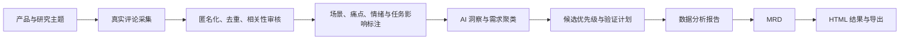

# VOC_To_MRD · 用户之声

把真实用户反馈，变成有依据的产品判断。

这是用户之声的**网站版本**：输入研究主题，经过评论采集、审核、归类和 AI 分析，输出原声库、需求洞察、数据报告和 MRD。当前提供可独立运行的本地网站，以及包含匿名座舱案例的静态页面。

## 目的／用途

帮助产品经理、研究人员和产品团队看清：用户在什么场景遇到问题、希望获得什么结果、哪些需求值得优先验证。

- 汇总真实好评、差评和建议，并保留来源。
- 从使用场景、痛点、任务影响和证据强度形成需求判断。
- 给出 P0／P1／P2 候选优先级、建议行动和验证方法。
- 在同一页面查看原声、AI 洞察和简短研究结论，下载完整报告用于评审。

## 输入

在首页“用户原声”气泡中输入**产品和关注的主题**，按回车发起调研。例如：

> 理想同学车载语音助手，重点研究导航理解、连续指令和使用中的好评与吐槽。

可以补充品牌／竞品、渠道、时间窗口、软件版本或决策用途。未指定的条件按探索性范围记录；版本未知时不推断。已有研究也可按 [CSV 字段规范](research-core/references/schema.md) 导入并生成页面。

首页输入发起新研究；原声库中的搜索框只筛选已经采集的数据。

## 输出：会得到什么

| 产物 | 内容与用途 |
|---|---|
| 原声库 | 匿名评论、来源、日期、版本和审核记录，帮助回到证据 |
| AI 需求洞察 | 场景、痛点、期望、任务影响、需求聚类及支撑评论 |
| 需求优先级 | P0／P1／P2、理由、建议行动与验证方式 |
| 简短研究结论 | 页面直接展示几条主要发现，快速了解结果 |
| 数据分析报告 | 回答“采到了什么、发现了什么、证据能说明什么”，用于分享和复核 |
| MRD | 回答“优先考虑哪些需求、为什么、如何验证”，用于需求评审和下一步产品规划 |
| HTML 页面 | 查看、搜索和筛选原声，展开需求证据，下载报告和 CSV |

新研究默认采用 [11 部分 MRD 框架](research-core/references/mrd.md)。仓库自带座舱案例是既有探索性 MRD v2，保留原有评审结构。BRD／PRD不作为默认自动交付。

## 流程



## Docker 打开网页

安装并启动Docker后，在项目目录执行：

```bash
docker compose up -d --build --wait
```

打开 **http://127.0.0.1:8780**。页面、匿名案例、原声筛选、洞察与报告下载都在容器内提供，不需要在宿主机启动Python服务。

```bash
docker compose ps
docker compose logs --tail=50 web
docker compose stop
```

8780被占用时，可设置其他发布端口：

```bash
VOC_PORT=8781 docker compose up -d --build --wait
```

此时打开`http://127.0.0.1:8781`。Compose只映射到宿主本机；研究文件写入命名卷，停止或重建容器不会删除卷，`docker compose down -v`会删除它。

默认Python镜像可独立浏览案例，但没有Codex、模型登录或采集连接器，不能发起新调研。真实研究需要在容器内单独配置这些能力；不会自动继承Mac上的登录或Chrome会话。[Docker与真实采集边界](docs/deployment.md)

## 不使用 Docker 的本地运行

页面生成和服务使用 Python 3.9+ 标准库，没有额外 Python 依赖。真实调研还需要已登录、有模型使用权限的 Codex CLI，以及执行环境可用的网络和采集工具。

```bash
git clone https://github.com/kyyoki-stack/VOC_To_MRD.git
cd VOC_To_MRD
python3 app.py
```

打开 `http://127.0.0.1:8780`。首页为通用研究入口；点击“查看座舱研究示例”才会打开既有案例。配置执行器后，输入新主题会在独立目录执行研究，完成后提供本次结果链接。端口可调整：

```bash
python3 app.py --port 8781
```

本项目内置研究工作流，不要求另外安装 Skill。账号登录、模型权限和采集连接器需要在本机准备好；只有 Python 也能浏览页面，但不能运行真实采集。不要将 Cookie、Token 或登录资料提交到仓库。

静态查看可以直接打开 `web/index.html`，示例位于 `web/examples/cockpit.html`。公开托管使用 `python3 build.py --static --output dist` 生成不调用本机API的页面。静态托管能够查看案例、筛选和下载；**GitHub 仓库或 GitHub Pages 本身不会执行 AI 调研**。

## 案例与证据

座舱案例包含67条匿名采集记录，其中41条与 AI 语音助手主题相关，形成8项候选需求。HTML和导出CSV保留67条已审核记录，原声库默认只显示41条相关反馈。

它们来自混合年份、车型和渠道，是目的性选取的评论记录，不代表41名独立车主，也不能用于推导总体满意度、故障率或最新OTA表现。报告保留原有采集与验证边界；本次仓库整理没有新增采集或实车测试。公开原声的权利属于原作者，来源链接随记录保留。

## 目录与维护

```text
VOC_To_MRD/
├── app.py                    # 本地网站入口
├── build.py                  # 从匿名案例重建页面
├── web/index.html            # 通用首页
├── web/examples/cockpit.html # 可选匿名研究示例
├── research-core/            # 工作流、字段规范、模板与本地后端
├── examples/cockpit/          # 匿名案例的CSV与Markdown报告
├── docs/                     # 架构、运行边界与部署说明
├── tests/                    # 项目构建与数据校验测试
└── research-runs/             # 每次新研究；运行时生成，不提交Git
```

修改视觉模板：`research-core/assets/template.html`。修改研究规则：`research-core/SKILL.md`和`references/`。修改案例后重建：

```bash
python3 build.py
python3 build.py --check
python3 -m unittest discover -s tests -v
python3 -m unittest discover -s research-core/scripts/tests -v
```

## 当前运行边界

Python直接运行时后端只绑定本机；Docker内监听容器网络，Compose仍只向宿主本机发布。真实研究使用Codex CLI；每次建立独立目录，同时最多一个任务，最长30分钟。采集不到正文或渠道无法访问时保留失败说明，允许交付空结果。接口检测到CLI不等于模型、登录和所有渠道均可用。

任务状态保存在内存，服务重启后不能恢复。预计时长为初步估计，实际耗时随渠道和模型变化。当前未提供多人账户、云端任务队列、持久化或计费，因此尚不是面向公众开放采集的生产服务。[架构说明](docs/architecture.md) · [部署说明](docs/deployment.md)

## 与 Skill 版的关系

[voice-of-customer-research](https://github.com/kyyoki-stack/voice-of-customer-research) 用于安装到 Codex 等宿主后执行调研；本仓库提供网站入口。两者沿用同一研究方法与数据契约，本仓库包含当前工作流副本，可以继续独立修改和发布。

代码采用 [MIT License](LICENSE)；公开评论及来源材料不在代码许可证授权范围内。
